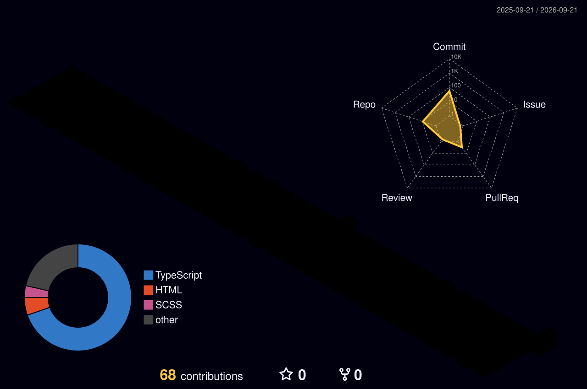

<div align="center">

</div>

## ✦ The developer behind the code

### Building intuitive applications, one line of code at a time\.

As an Application Developer, I craft efficient and user\-centric solutions using modern web technologies\. My experience spans TypeScript, JavaScript, and HTML, bringing ideas from concept to functional interfaces\. I focus on developing systems for better organization, management, and personal showcasing\. My passion lies in solving practical challenges and creating engaging digital experiences that are both robust and easy to use\.

**Focus:** Application Developer

**Technologies:** TypeScript · HTML · JavaScript · Git · React · Node\.js · CSS · Web Development · UI/UX Design Principles · Front\-end Development · Back\-end Development · SCSS · Python · Jupyter Notebook · Application Development · Frontend Development · Responsive Design

**Currently learning:** Exploring advanced patterns in React and Node\.js to build more scalable and performant full\-stack applications\.

> The art of programming is the art of organizing complexity\.

```ts
const developer = {
  name: "Sai Prudhvi Charan Pothumsetty",
  role: "Application Developer",
  focus: ["Full-stack Application Development","User Interface and User Experience Design","System Architecture and Scalability","Code Quality and Maintainability","Automated Workflow Enhancements"],
  toolkit: ["TypeScript","HTML","JavaScript","Git","React","Node.js","CSS","Web Development","UI/UX Design Principles","Front-end Development","Back-end Development","SCSS","Python","Jupyter Notebook","Application Development","Frontend Development","Responsive Design"],
  exploring: "Exploring advanced patterns in React and Node.js to build more scalable and performant full-stack applications.",
  principle: "The art of programming is the art of organizing complexity."
};
```

## ◈ What I build

- Full\-stack Application Development
- User Interface and User Experience Design
- System Architecture and Scalability
- Code Quality and Maintainability
- Automated Workflow Enhancements

## ◎ Connect

<p align="center"><a href="https://github.com/Prudhvicharan"></a> <a href="https://www.linkedin.com/in/prudhvi-charan/"></a> <a href="https://prudhvicharan.com/"></a> <a href="mailto:bunnycharanprudhvi%40gmail.com"></a></p>

## ⌘ Technology constellation

<p align="center"></p>

<p align="center"><code>TypeScript</code> <code>HTML</code> <code>JavaScript</code> <code>Git</code> <code>React</code> <code>Node.js</code> <code>CSS</code> <code>Web Development</code> <code>UI/UX Design Principles</code> <code>Front-end Development</code> <code>Back-end Development</code> <code>SCSS</code> <code>Python</code> <code>Jupyter Notebook</code> <code>Application Development</code> <code>Frontend Development</code> <code>Responsive Design</code></p>

## ◇ Beyond the code

- I've built multiple portfolio sites, always refining the way I showcase my work\.
- My projects often explore solutions for management, tracking, or organizational challenges\.
- I enjoy experimenting with both frontend elegance and backend logic to create complete applications\.
- **I'd like to build:** To develop an open\-source, modular project management suite that integrates task tracking, resource allocation, and collaborative documentation, offering customizable dashboards for different team roles\.

## → How I work

- Emphasizing clear communication and documentation\.
- Prioritizing modular and reusable code\.
- Adopting an iterative approach to development\.
- Focused on problem\-solving and continuous learning\.
- Committed to delivering robust and polished solutions\.

## ↗ Now and next

- Deepen expertise in backend frameworks and API design\.
- Contribute more actively to open\-source projects\.
- Explore cloud native development practices\.
- Build a more complex, data\-driven application\.

## ◆ At a glance

<div align="center">
<table><tr><td align="center"><strong>28</strong><br/><sub>PUBLIC REPOSITORIES</sub></td><td align="center"><strong>2</strong><br/><sub>FOLLOWERS</sub></td><td align="center"><strong>0</strong><br/><sub>SELECTED REPO STARS</sub></td><td align="center"><strong>0</strong><br/><sub>SELECTED REPO FORKS</sub></td></tr></table>
<p> </p>
</div>

## ▦ Engineering footprint

<div align="center">
<table><tr><td align="center"><strong>8</strong><br/><sub>ORIGINAL BUILDS</sub></td><td align="center"><strong>0</strong><br/><sub>REPOSITORY FORKS</sub></td><td align="center"><strong>6</strong><br/><sub>PORTFOLIO LANGUAGES</sub></td><td align="center"><strong>0</strong><br/><sub>PROJECT TOPICS</sub></td></tr></table>
</div>

## ◒ Language mix

<div align="center">
<table><tr><td><strong>TypeScript</strong></td><td><code>████░░░░░░</code></td><td align="right">35%</td></tr><tr><td><strong>JavaScript</strong></td><td><code>██░░░░░░░░</code></td><td align="right">23%</td></tr><tr><td><strong>HTML</strong></td><td><code>██░░░░░░░░</code></td><td align="right">19%</td></tr><tr><td><strong>Jupyter Notebook</strong></td><td><code>██░░░░░░░░</code></td><td align="right">15%</td></tr><tr><td><strong>Python</strong></td><td><code>█░░░░░░░░░</code></td><td align="right">4%</td></tr><tr><td><strong>SCSS</strong></td><td><code>█░░░░░░░░░</code></td><td align="right">4%</td></tr></table>
<p><sub>PRIMARY LANGUAGES ACROSS 28 IMPORTED PUBLIC REPOSITORIES</sub></p>
</div>

## ◫ Contribution streak

<div align="center">

</div>

## ◉ Public work snapshot

<div align="center">
<p><strong>8</strong> featured repositories · <strong>8</strong> original projects · Working across <strong>TypeScript, JavaScript, HTML, Jupyter Notebook, Python, SCSS</strong></p>
</div>

## 🚀 Featured builds

<table><tr><td width="50%" valign="top"><h3><a href="https://github.com/Prudhvicharan/Balancio">Balancio</a></h3><p>Balancio: Explores creating a system for managing personal or small-scale financial balances.</p><sub>TypeScript · 0 ★</sub></td><td width="50%" valign="top"><h3><a href="https://github.com/Prudhvicharan/inbox-hire">inbox-hire</a></h3><p>inbox-hire: Investigates developing a system for managing hiring processes or communications within an inbox-like interface.</p><sub>TypeScript · 0 ★</sub></td></tr><tr><td width="50%" valign="top"><h3><a href="https://github.com/Prudhvicharan/re-portfolio">re-portfolio</a></h3><p>re-portfolio: Focuses on building a personal portfolio to showcase development projects and skills.</p><sub>TypeScript · 0 ★</sub></td><td width="50%" valign="top"><h3><a href="https://github.com/Prudhvicharan/Milk-Diary">Milk-Diary</a></h3><p>Milk-Diary: Examines the creation of a simple tracking or diary application, potentially for daily records.</p><sub>HTML · 0 ★</sub></td></tr><tr><td width="50%" valign="top"><h3><a href="https://github.com/Prudhvicharan/launchmasters-prod">launchmasters-prod</a></h3><p>launchmasters-prod: Represents a production-ready iteration of a project management or launch coordination system.</p><sub>TypeScript · 0 ★</sub></td><td width="50%" valign="top"><h3><a href="https://github.com/Prudhvicharan/launchmasters">launchmasters</a></h3><p>launchmasters: Explores the development of a tool for managing project launches and related tasks.</p><sub>TypeScript · 0 ★</sub></td></tr><tr><td width="50%" valign="top"><h3><a href="https://github.com/Prudhvicharan/Career-Axis">Career-Axis</a></h3><p>Career-Axis: Investigates creating a utility or platform focused on career development or exploration.</p><sub>JavaScript · 0 ★</sub></td><td width="50%" valign="top"><h3><a href="https://github.com/Prudhvicharan/gitfolio">gitfolio</a></h3><p>gitfolio: Concentrates on developing a portfolio that integrates and presents GitHub-based project information.</p><sub>TypeScript · 0 ★</sub></td></tr></table>

## ◫ Contribution landscape



<div align="center">
<br/>
<strong>Eager to collaborate on innovative web solutions and open\-source projects\. Let's build something impactful together\!</strong>
<br/><br/>
<a href="https://github.com/Prudhvicharan">Explore my work on GitHub →</a>
</div>
